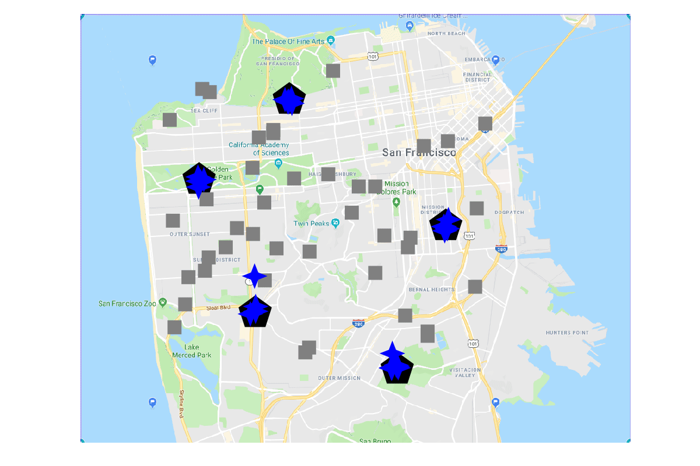

# SCoBA
Accompanying code repository for the paper:

> S. Choudhury, J. K. Gupta, M. J. Kochenderfer, D. Sadigh, and J. Bohg. "Dynamic Multi-Robot Task Allocation under Uncertainty and Temporal Constraints" *Robotics: Science and Systems 2020*

In this paper, we present a hierarchical multi-robot allocation algorithm that plans under task completion uncertainty and time window constraints. We call our algorithm SCoBA (Stochastic Conflict-Based Allocation). The lower layer generates single-robot allocation policies with dynamic programming and tree search, while the upper layer uses optimal conflict resolution logic to obtain a valid multi-agent allocation. Please see the extended version on Arxiv (add Link) for the details.

## Illustrations

The GIF below visualizes SCoBA on one of the scenarios from the Multi-Drone Delivery domain, in North San Francisco. The scenario has 5 depots and 30 drones, and the drones allocated to a stream of incoming delivery requests with probability 0.5; details in Section V (Evaluation) of the paper. _Delivery locations (gray squares) are randomly generated within a bounding
box, and some of them may be slightly offshore_.



## Setup and Usage

Ensure that you have installed Julia from [their website](https://julialang.org/downloads/). 

To the reproduce the experiments in the `scripts/` folder, first clone this
repository:
```bash
git clone https://github.com/sisl/SCoBA.jl SCoBA
cd SCoBA
```
First instantiate the subproject in `scripts/` folder:
```bash
julia --project=scripts -e 'using Pkg; Pkg.instantiate()'
```
Now you can run any scripts in `scripts/` folder. For example:
```bash
julia --project=scripts scripts/benchmark_routing.jl -n 10 -t 100 -d 15 -e 5 -p 0.5 -w 30 scoba
r_dr15_dep5_probpt5_win30_scoba.json
```


If you just wish to use the algorithm or domains, from the Julia Pkg mode REPL:
```julia
pkg> add https://github.com/JuliaLang/TOML.jl 
pkg> add https://github.com/sisl/SCoBA.jl
```

There are 4 scripts in the `scripts/` folder, for the two kinds of evaluations on each of the two domains in the paper. The `scripts/benchmark_*` scripts are for the unsuccessful task penalty (for all baselines) and the `scripts/scaling_*` scripts are for the computation time results for the subset of baselines we show in the paper. **Each script has an example comment at the end for how it should be called.** The scripts should approximately reproduce the corresponding results in the paper, with possible variations in computation time due to versions and hardware. Please open an issue if you have any issues re-running anything.

**N.B** Running `benchmark_conveyor_belt` with QLearning (for the saved policy) requires the precomputed policy files. We did not upload them to Github; please open an issue if you need them.

## Code Overview
The two sub-folders in `src/`, i.e., `solver/` and `domains/` contain the domain-agnostic SCoBA algorithm and the domain-dependent implementations respectively. If you want to implement SCoBA on your own domain, you can just import the solver through `using SCoBA.SCoBASolver` and refer to the `domains/` sub-folders for examples of how to use it.

Within `src/solver/`, the following are the summaries of the relevant files:

- `solver/types.jl` Defines the various domain-agnostic datastructures required by SCoBA (to represent the policy tree, time windows, and so on). The key thing to look at if you want to use SCoBA on another domain is the templated `GenericAllocation` structure, which it uses to track the assignment of agents to tasks.
- `solver/scoba_tree_search.jl` Implements the lower layer of SCoBA, i.e., the per-agent policy tree search. If you want to use just the tree search in a custom manner (as in the conveyor belt domain; check `domains/conveyor_belt_scoba.jl`), then look at the `generate_search_tree!` and `get_next_attempt_idx` methods.
- `solver/scoba_conflict_resolution.jl` Implements the higher layer of SCoBA, i.e. the multi-agent conflict resolution. The structure of the `coordinate_allocation.jl` is very similar to [the implementation](https://github.com/Shushman/MultiAgentPathFinding.jl/blob/master/src/cbs.jl) of the Conflict-Based Search Algorithm in `MultiAgentPathFinding`.
